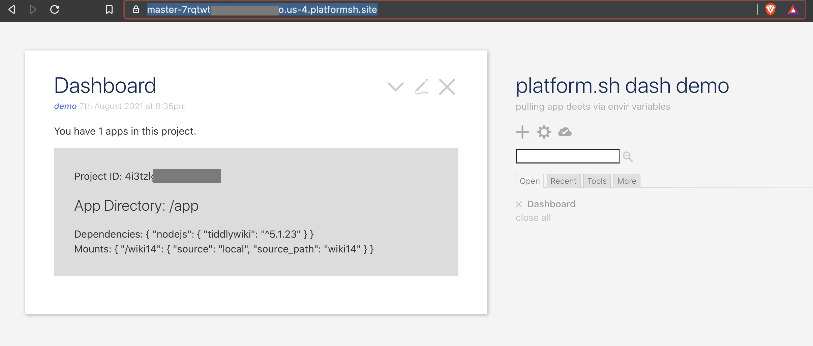

# Platform.sh Apps Dashboard

Display apps in your platform acct -- and their env vars and particulars -- in a standalone node js app. 

## Background

1. Platform.sh is a PaaS solution for managing a fleet of apps.

2. p.sh supports many kinds of apps and is popular for "fleet management" of many public websites, such as lots of drupal or magento or even wordpress installs. 

3. p.sh uses the power of infrastructure-as-code to streamline the deployment and management of your apps and associated infrastructure like databases. As such, it's all about the YAML files. Edit these files and push to git and voila, all your devops are belong to us. 

## Purpose of Repo

1. p.sh provides many tempalates to deploy common software like wordpress.

2. To experiment with the platform, I wanted to see if it could be a cool new place to host [TiddlyWikis](https://tiddlywiki.com), and deploy TWs at will with YAML. 

3. In doing the experiment, I learned that there could also be a great use case for a simple node app like this as part of a fleet management framework. 
    1. For example, if a team member wants to see an overview of all apps deployed, they need risky permissions: they have to have git access to the environment, or access to the platform account itself. Yikes. 
    2. Let's say you want a nice clean digest of the apps running, and their associated environment variables, but you don't want to be in the danger zone every time you view this info... 
    3. This node app will provide that by ingesting JSON from all deployed apps and providing the digest in a neat webpage. 

## Basics

1. It's really just a single YAML file that's unique, but there is some prework. 
    1. I used p.sh's node template and ran `npm install tiddlywiki` in the top level of the rep to make sure I had proper node modules and package.json. 
    2. After that, I just edited the `.platform.app.yaml` file. More or that in a sec under YAML Details. 
2. I also had a folder for a wordpress deploy... Since my developer account only supports 1 deployed app, I could not test many apps at once. So the only app in the dashboard will be the dashboard app itself :-)

## YAML Details

1. The beauty of all these "cloudformation" kind of setups is you can deploy by simply pushing a git repo. 

2. In the file `.platform.app.yaml`, you can make use of whatever "build hooks" you need to pack/init/whatever your app. Depending on your needs and deploy steps, there is some art to deciding which of the three opportunities to run hooks you should use--
    1. *build* hooks, aptly-named, are those first hooks you want to run to start building your app. Note that not all env variables, such as routes, are available at this stage, since you haven't deployed yet. 
    2. *deploy* hooks could in theory be the commands you would normally run to start your app, but may not be needed if your app can be deployed with a single command under `web -> commands -> start` in the YAML file.
    3. *post-deploy* hooks are like they sound, commands that you run once the app is deployed. These sounded super handy at first, but for me are a little tricky so far, because storage is designed to be read-only at this stage -- so you can't write to your storage in the post-deploy hooks. 

3. On storage, note that these solutions like p.sh often use containers, and we shouldn't lose sight of the fact that storage is ephemeral (ie not persistent in the way we're used to). 
    1. In the case of PHP monoliths, you at least have a database to help persist the state of your application; but in the case of TiddlyWiki on Node, we don't use a database, and the state is maintained in tiddler files in your storage. 
    2. For TiddlyWiki, my approach was to deploy the app twice, specifying the same "bucket" for storage each time:
        1. **First deploy**: comment out all hooks and use the start command to init the wiki in your designated storage like `tiddlywiki wiki14 --init server`. In hindsight I believe it may be better to do the `init` in a hook instead (build or deploy, I need to start over and will update this readme). This is because when you init a new wiki in a start command, the storage is already read-only, so you can't write the tiddlywiki.info file your wiki requires.  
        2. **Subsequent deploy(s)**: use the build hooks to gather environment variables, collate the info into a json object, and drop into our storage. 

### Hooks are our friends 

4. As we see when re-deploying in 3.2.2 above, we are using both the *build* hook and the *deploy* hook:
    1. The _build hook_ is just basic shell commands to gather some environment variables and write them to a "tiddler" file, which can later be consumed (and displayed!) by our dashboard. 
    2. The _deploy hook_ is used to move the tiddler file we created in the build hook and copy it into the storage for our dashboard. 

5. IF YOU MIMIC STEP 4 HOOKS ABOVE FOR OTHER APPS LIKE DRUPAL/WP/ETC, you can easily build a neat dashboard showing all your platform.sh apps! 

## See it 

1. This node app is currently deployed but is secured with basic auth. Reach out to me [@philwonski](https://twitter.com/philwonski) for the URL and demo credentials. 

## To-Do & Notes 

1. Change init workflow for initial deploy (3.2.1 under YAML Details above).

2. Tweak shell commands (3.2.2 under YAML Details) since json object has lots of nesting and may not always be valid json. 

3. Try different CI/CD workflows and redeploy + restarts... Note that the node_modules / package.json is a little large now because I also tried to get pm2 working to do restarts, but haven't succeeded yet. This is also why there are random little shell scripts in the repo, I'm still experimenting. 

4. Once the hooks are perfected, upgrade the plan so I can add hooks to other apps and see their data displayed in the dashboard. 

5. Figure out how to get the *Routes* environment variable object and include it in the dash. This is tricky for the TW node app itself since the storage is not writeable once the Routes are available to be recorded... in theory it may be easier when using multiple apps, if you redeploy the dashboard every time you deploy another app... still thinking about this... 